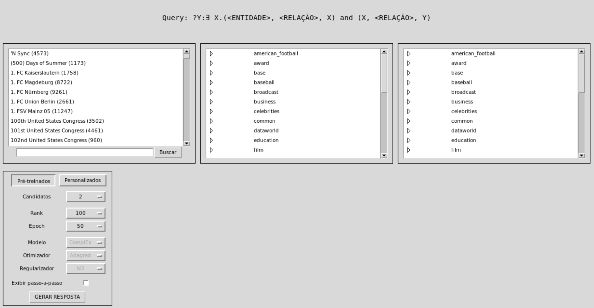

## Interface gráfica para _query answering_ com CQD

Objetiva-se oferecer um conjunto de métodos de apoio e uma interface gráfica para facilitar a utilização do método CQD (disponível em https://github.com/uclnlp/cqd) no processamento de perguntas.

O principal componente está em ui/Window, cuja interface está exemplificada abaixo. Nesta, pode-se construir uma pergunta do tipo 1\_2 (vide implementação CQD para detalhes) e processá-la utilizando dezesseis diferentes modelos de predição, dentre os quais oito são propostos pelos autores originais e outros oito foram treinados para esta implementação.



Para abrir a interface, basta executar em um terminal Linux (observe que, se estiver utilizando WSL, será necessário exportar o display).
```
python3 main.py
```

Disponibiliza-se, ainda, um conjunto de geradores, tanto para auxiliar na construção de uma pergunta quanto na execução de testes automatizados.